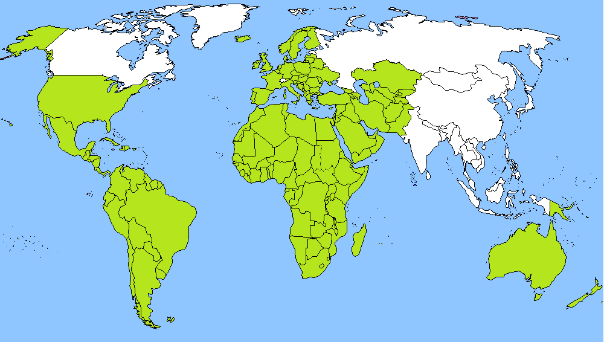
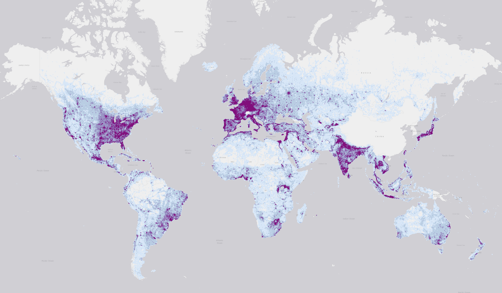

Introduction
-------------------
Bing Maps is releasing mined roads around the world. We have detected <b>48.9M km</b> of all roads and 1165K km of roads missing from OSM. Mining is performed with Bing Maps imagery between 2020 and 2022 including Maxar and Airbus. The data is freely available for download and use under the [Open Data Commons Open Database License (ODbL)](https://opendatacommons.org/licenses/odbl/).

## Data

<!---->

<!---
lolol
| Date          | Region   | Length in '000 Km   |
:----------------:|:------------:|:---------:
| 20 May 2020 | [United States](https://usaminedroads.z19.web.core.windows.net/USA.zip) | 9,308 |
| 21 Mar 2021 | [South America](https://usaminedroads.z19.web.core.windows.net/SouthAmerica-Full.zip) | 4,480 |
| 21 Jan 2022 | [Caribbean Islands](https://usaminedroads.z19.web.core.windows.net/CaribbeanIslands-Full.zip) | 232 |
| 03 Mar 2022 | [Middle East](https://usaminedroads.z19.web.core.windows.net/MiddleEast-Full.zip) | 3,444 |
| 05 Apr 2022 | [Central Asia](https://usaminedroads.z19.web.core.windows.net/AsiaCenter-Full.zip) | 1,204 |
| 18 Apr 2022 | [Northern Africa](https://usaminedroads.z19.web.core.windows.net/AfricaNorth-Full.zip) | 1,077 |
| 28 Apr 2022 | [Western Africa](https://usaminedroads.z19.web.core.windows.net/AfricaWest-Full.zip) | 982 |
| 28 Apr 2022 | [Central Africa](https://usaminedroads.z19.web.core.windows.net/AfricaCenter-Full.zip) | 324 |
| 12 May 2022 | [Eastern Africa](https://usaminedroads.z19.web.core.windows.net/AfricaEast-Full.zip) | 1,151 |
| 12 May 2022 | [Southern Africa](https://usaminedroads.z19.web.core.windows.net/AfricaSouth-Full.zip) | 1,506 |
| 08 Jun 2022 | [Europe](https://usaminedroads.z19.web.core.windows.net/Europe-Full.zip) | 10,212 |
| 03 Jul 2022 | [Oceania](https://usaminedroads.z19.web.core.windows.net/Oceania-Full.zip) | 1,947 |
| 27 Jul 2022 | [Central America](https://usaminedroads.z19.web.core.windows.net/AmericaCenter-Full.zip) | 1,376 |
| 03 Aug 2022 | [Canada](https://usaminedroads.z19.web.core.windows.net/Canada-Full.zip) | 1,832 |
| 13 Aug 2022 | [South Asia](https://usaminedroads.z19.web.core.windows.net/AsiaSouth-Full.zip) | 3,723 |
| 12 Sep 2022 | [Southeastern Asia](https://usaminedroads.z19.web.core.windows.net/AsiaSouthEast-Full.zip) | 2,744 |
| 19 Sep 2022 | [North Asia](https://usaminedroads.z19.web.core.windows.net/AsiaNorth-Full.zip) | 2,259 |
| 27 Feb 2023 | [Japan](https://usaminedroads.z19.web.core.windows.net/Japan-Full.zip) | 1,105 |
-->
<table>
    <thead>
        <tr>
	    <th colspan=1, rowspan=2>Date</th>
            <th colspan=2>All ML derived Roads</th>
            <th colspan=2>ML derived Roads missing from OSM</th>
        </tr>
	<tr>
            <th>Region</th> <th>Length in '000 Km</th>
	    <th>Region</th> <th>Length in '000 Km</th>
        </tr>
    </thead>
    <tbody>
		<tr>
			<td>20 May 2020</td>
			<td><a href="https://usaminedroads.z19.web.core.windows.net/USA.zip">United States</a></td>
			<td>9,308</td>
			<td><a href="https://usaminedroads.z19.web.core.windows.net/origUSA-PreMerge.zip">United States</a></td>
			<td>818</td>
		</tr>
		<tr>
			<td>21 Mar 2021</td>
			<td><a href="https://usaminedroads.z19.web.core.windows.net/SouthAmerica-Full.zip">South America</a></td>
			<td>4,480</td>
			<td><a href="https://usaminedroads.z19.web.core.windows.net/SouthAmerica-PreMerge.zip">South America</a></td>
			<td>98</td>
		</tr>
		<tr>
			<td>21 Jan 2022</td>
			<td><a href="https://usaminedroads.z19.web.core.windows.net/CaribbeanIslands-Full.zip">Caribbean Islands</a></td>
			<td>232</td>
			<td><a href="https://usaminedroads.z19.web.core.windows.net/CaribbeanIslands-PreMerge.zip">Caribbean Islands</a></td>
			<td>5</td>
		</tr>
		<tr>
			<td>03 Mar 2022</td>
			<td><a href="https://usaminedroads.z19.web.core.windows.net/MiddleEast-Full.zip">Middle East</a></td>
			<td>3,444</td>
			<td><a href="https://usaminedroads.z19.web.core.windows.net/MiddleEast-PreMerge.zip">Middle East</a></td>
			<td>84</td>
		</tr>
		<tr>
			<td> 05 Apr 2022</td>
			<td><a href="https://usaminedroads.z19.web.core.windows.net/AsiaCenter-Full.zip">Central Asia</a></td>
			<td>1,204</td>
			<td><a href="https://usaminedroads.z19.web.core.windows.net/AsiaCenter-PreMerge.zip">Central Asia</a></td>
			<td>28</td>
		</tr>
		<tr>
			<td>18 Apr 2022</td>
			<td><a href="https://usaminedroads.z19.web.core.windows.net/AfricaNorth-Full.zip">Northern Africa</a></td>
			<td>1,077</td>
			<td><a href="https://usaminedroads.z19.web.core.windows.net/AfricaNorth-PreMerge.zip">Northern Africa</a></td>
			<td>24</td>
		</tr>
		<tr>
			<td>28 Apr 2022</td>
			<td><a href="https://usaminedroads.z19.web.core.windows.net/AfricaWest-Full.zip">Western Africa</a></td>
			<td>982</td>
			<td><a href="https://usaminedroads.z19.web.core.windows.net/AfricaWest-PreMerge.zip">Western Africa</a></td>
			<td>32</td>
		</tr>
		<tr>
			<td>28 Apr 2022</td>
			<td><a href="https://usaminedroads.z19.web.core.windows.net/AfricaCenter-Full.zip">Central Africa</a></td>
			<td>324</td>
			<td><a href="https://usaminedroads.z19.web.core.windows.net/AfricaCenter-PreMerge.zip">Central Africa</a></td>
			<td>6</td>
		</tr>
		<tr>
			<td>12 May 2022</td>
			<td><a href="https://usaminedroads.z19.web.core.windows.net/AfricaEast-Full.zip">Eastern Africa</a></td>
			<td>1,151</td>
			<td><a href="https://usaminedroads.z19.web.core.windows.net/AfricaEast-PreMerge.zip">Eastern Africa</a></td>
			<td>31</td>
		</tr>
		<tr>
			<td>12 May 2022</td>
			<td><a href="https://usaminedroads.z19.web.core.windows.net/AfricaSouth-Full.zip">Southern Africa</a></td>
			<td>1,506</td>
			<td><a href="https://usaminedroads.z19.web.core.windows.net/AfricaSouth-PreMerge.zip">Southern Africa</a></td>
			<td>40</td>
		</tr>
		<tr>
			<td>08 Jun 2022</td>
			<td><a href="https://usaminedroads.z19.web.core.windows.net/Europe-Full.zip">Europe</a></td>
			<td>10,212</td>
			<td>N/A</td>
			<td>N/A</td>
		</tr>
		<tr>
			<td>03 Jul 2022</td>
			<td><a href="https://usaminedroads.z19.web.core.windows.net/Oceania-Full.zip">Oceania</a></td>
			<td>1,947</td>
			<td>N/A</td>
			<td>N/A</td>
		</tr>
		<tr>
			<td>27 Jul 2022</td>
			<td><a href="https://usaminedroads.z19.web.core.windows.net/AmericaCenter-Full.zip">Central America</a></td>
			<td>1,376</td>
			<td>N/A</td>
			<td>N/A</td>
		</tr>
		<tr>
			<td>03 Aug 2022</td>
			<td><a href="https://usaminedroads.z19.web.core.windows.net/Canada-Full.zip">Canada</a></td>
			<td>1,832</td>
			<td>N/A</td>
			<td>N/A</td>
		</tr>
		<tr>
			<td>13 Aug 2022</td>
			<td><a href="https://usaminedroads.z19.web.core.windows.net/AsiaSouth-Full.zip">South Asia</a></td>
			<td>3,723</td>
			<td>N/A</td>
			<td>N/A</td>
		</tr>
		<tr>
			<td>12 Sep 2022</td>
			<td><a href="https://usaminedroads.z19.web.core.windows.net/AsiaSouthEast-Full.zip">Southeastern Asia</a></td>
			<td>2,744</td>
			<td>N/A</td>
			<td>N/A</td>
		</tr>
		<tr>
			<td>19 Sep 2022</td>
			<td><a href="https://usaminedroads.z19.web.core.windows.net/AsiaNorth-Full.zip">North Asia</a></td>
			<td>2,259</td>
			<td>N/A</td>
			<td>N/A</td>
		</tr>
		<tr>
			<td>27 Feb 2023</td>
			<td><a href="https://usaminedroads.z19.web.core.windows.net/Japan-Full.zip">Japan</a></td>
			<td>1,105</td>
			<td>N/A</td>
			<td>N/A</td>
		</tr>
	</tbody>
</table>

## FAQ

#### What is the GeoJson format?
GeoJSON is a format for encoding a variety of geographic data structures. 
For Intensive Documentation and Tutorials, Refer to [GeoJson Blog](http://geojson.org/)

#### Data generation details:
The road extraction is done in four stages (full drop went through two stages and OSM missing set went through all four):
1.	Semantic Segmentation – Recognizing road pixels on the aerial image using Convolutional Neural Network (CNN).
2.	Geometry Generation - A series of algorithms and processes transforming output of semantic segmentation into roads in geometry format.
    - Image postprocessing
    - Thinning
    - Connectivity improvement
    - Graph construction
    - Finalizing road shapes and network quality
    - Stiching road geojsons between neighboring images where needed
3.  Conflation & Cutting - Excluding roads and parts of roads that already exist in the road network (OSM).
4.  Classification - A classifier to filter out low-confidence roads and predict a road type.

#### Neural network architecture and dataset
Our network was based on UNet and ResNet and the following papers [U-Net] (https://arxiv.org/abs/1505.04597), [Res U-Net] (https://arxiv.org/pdf/1512.03385.pdf), [Res U-Net] (https://arxiv.org/pdf/1711.10684.pdf).
The model was trained on 512x512 images, it is fully-convolutional, which allows images of any size (that is divisable by 64) be processed by the model (constrained by GPU memory, 1088x1088 in our case). The training set consists of 20000 labeled images. Majority of the satellite images cover diverse areas all around the world. To achieve a good set representation, we have enriched the set with samples from various areas covering mountains, glaciers, forests, deserts, beaches, coasts, etc.
Images in the set are of 1088x1088 pixel size with 100 cm/pixel resolution. The training is done with Keras toolkit.

#### Metrics
We measure intermediate stage metrics to track performance of our models. <i>Pixel metric</i> measures performance of the the Convolutional Neural Network and <i><a href='https://medium.com/the-downlinq/spacenet-road-detection-and-routing-challenge-part-i-d4f59d55bfce'>APLS metric (Average Path Length Similarity)</a></i> measures overall connectivity after geometry generation stage.

| Metric        | Precision    | Recall    |
| ------------- |:-------------:|:-------------:|
|Pixel|85.24%|82.81%|
|APLS|87.53%|79.33%|

#### Data Vintage
The vintage of the roads depends on the vintage of the underlying imagery. Because Bing Imagery is a composite of multiple sources it is difficult to know the exact dates for individual pieces of data.

#### How good is the data?
The Osm Missing Data went through a final classifier to ensure that the precision is at least 95% (90% for USA now - to be updated to 95% in 2022). After classifier filters out potentially bad roads we remeasure the precision and make sure that it is 95% before releasing results

#### Why is the data being released?
Microsoft has a continued interest in supporting a thriving OpenStreetMap ecosystem.

# Contributing

This project welcomes contributions and suggestions.  Most contributions require you to agree to a
Contributor License Agreement (CLA) declaring that you have the right to, and actually do, grant us
the rights to use your contribution. For details, visit https://cla.opensource.microsoft.com.

When you submit a pull request, a CLA bot will automatically determine whether you need to provide
a CLA and decorate the PR appropriately (e.g., status check, comment). Simply follow the instructions
provided by the bot. You will only need to do this once across all repos using our CLA.

This project has adopted the [Microsoft Open Source Code of Conduct](https://opensource.microsoft.com/codeofconduct/).
For more information see the [Code of Conduct FAQ](https://opensource.microsoft.com/codeofconduct/faq/) or
contact [opencode@microsoft.com](mailto:opencode@microsoft.com) with any additional questions or comments.

# Legal Notices

Microsoft, Windows, Microsoft Azure and/or other Microsoft products and services referenced in the documentation
may be either trademarks or registered trademarks of Microsoft in the United States and/or other countries.
The licenses for this project do not grant you rights to use any Microsoft names, logos, or trademarks.
Microsoft's general trademark guidelines can be found at http://go.microsoft.com/fwlink/?LinkID=254653.

Privacy information can be found at https://privacy.microsoft.com/en-us/

Microsoft and any contributors reserve all other rights, whether under their respective copyrights, patents,
or trademarks, whether by implication, estoppel or otherwise.
